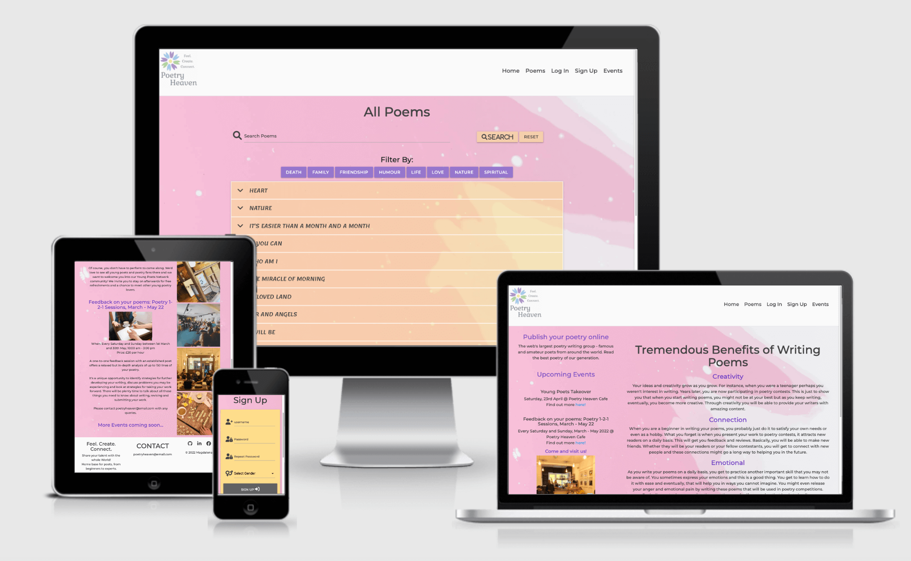

# Poetry Heaven

View the repository in GitHub [here](https://github.com/Madeline8/poetryheaven)

View the live project [here](https://poetry-heaven.herokuapp.com/)

Table of Contents
=================

   * [USER EXPERIENCE (UX)](#user-experience-ux)
      * [PROJECT GOALS](#project-goals)
      * [USER STORIES](#user-stories)
      * [DESIGN](#design)
      * [WIREFRAMES](#wireframes)
   * [DATABASE SCHEMA](#database-schema)
   * [FEATURES](#features)
      * [EXISTING FEATURES](#existing-features)
      * [FEATURES STILL TO IMPLEMENT](#features-still-to-implement)
   * [TECHNOLOGIES USED](#technologies-used)
      * [LANGUAGES USED](#languages-used)
      * [FRAMEWORKS, LIBRARIES AND AND PROGRAMS USED](#frameworks-libraries-and-and-programs-used)
      * [TESTING TOOLS USED](#testing-tools-used)
   * [TESTING](#testing)
   * [DEPLOYMENT](#deployment)
      * [REQUIREMENTS](#requirements)
      * [FORKING THE GITHUB REPOSITORY](#forking-the-github-repository)
      * [CLONING PROJECT](#cloning-project)
      * [DEPLOYMENT TO HEROKU](#deployment-to-heroku)
   * [CREDITS](#credits)
      * [CODE](#code)
      * [CONTENT](#content)
      * [MEDIA](#media)
   * [Acknowledgements](#acknowledgements)
   * [Disclaimer](#disclaimer)

## USER EXPERIENCE (UX)

### PROJECT GOALS

- Build a Python Flask App where the data is managed on MongoDB (document-based or NoSQL database) using  Materialize Framework
- Flask framework is used in order to easily connect the database to HTML forms and to manage CRUD functionality

### USER STORIES

-   First Time Visitor Goals
    -   as a First Time Visitor, I want to understand immediately what the website offers
    - as a First Time Visitor, I want to enjoy accessing and navigating through the website easily from any device, whether it is mobile, tablet or desktop.
    -    as a First Time Visitor, I want to be able to easily sign up,  with the need to only provide basic information
    - as a First Time Visitor, I want to be able to view all poems to assess if it's worthy signing up
    - as a First Time Visitor, I want to be able to search for poems using keywords, so I can find the poems I might like the most
    - as a First Time Visitor, I want to be able to filter poems by categories, so that I can find poems accordingly within my favourite category at a time
    -  as a First Time Visitor, I want to be able to see more information regarding specific poem i.e. Name of the person who created it and whether they are female or a male, date a poem was created and where it was created (location). 

-   Site Member Goals
Please note all goals above also apply for Site Members 
    -  as a Website User, I want to be able to get into my existing account without re-registering
    -  as a Website User, I want to have my own profile where I can maintain my poems
    - as a Website User, I want to be able to open my poem in a separate page so I'm less distracted when reviewing it
    -  as a Website User, I want to be able to update my poem
    - as a Website User, I want to be able to delete my poem, if I no longer want to share this poem with others
    - as a Website User, I want to be able to logout of my profile

-   Admin Goals
Please note all goals above also apply for Admin as well.
    -   As an admin, I want to be able to add new categories, so I can keep Poetryheaven updated at all times
    -   As an admin, I want to be able to update categories, if I feel it needs the name changing
    - As an admin, I want to be able to delete categories, if they are no longer needed.

  - Business Owner (or Admin if Admin is the Business Owner)
 Please note all goals above also apply for Business Owner as well.
    -   as the owner, I want to keep my visitors engaged and wanting to come back and share more poems

### DESIGN

**Colour Scheme**

The following aspects were taken into account when deciding on the colour scheme for this project:

- Complimentary colours - significant in creating good visual effects, so the user is comfortable with spending time browsing through the website.
- Colour in relation to writing - doesn't clash with the background colours. Different colours convey different meanings and evoke different emotions.
- Colour scheme makes the text easy to read.
- Colours to work together with the layout of the Website - colour scheme to be consistent throughout the project.

Purple, and orange colours complimented the white and pink background so they have been selected for this project.

**Orange** colour is strongly associated with energy, excitement, enthusiasm, and warmth. 
One of the meanings of **purple** colour is mystery, creativity, or wisdom. 
**Light pink** refers to something delicate and fragile, it symbolises softness.

The colours above describe what poetry is all about. These colours set the brand personality for the website. 

**Typography**

One of the project aims was to make sure the appropriate styles are applied, so the user has full clarity and feels engaged when navigating around the website. 

Web safe fonts are the new standard in web design.

Main style for this project is '*Montserrat*'. It is a common, widely used, web safe font family. It is considered as one of the most popular new css fonts. 

Second style that was chosen was '*Lemonada*', which is a modern Arabic and Latin typeface family. I decided to implement it as it gives poems' content more personal touch as well as the fact that it's similar to handwritten text. 
If 'Lemonada' cannot be accessed, the css will pick up 'Montserrat' instead. 

**Imagery**

I decided to decrease imagery to the minimum during this project and put more focus on emphasising the topic of poetry. 

### WIREFRAMES

[Balsamiq](https://balsamiq.com/) was the tool used in this project to create low-fidelity wireframes for desktop, iPad and iPhone. 

Poetry Heaven [Wireframes](static/images/testing/milestone3-wireframes.pdf)

Note: During the design stage, I decided to make some changes in order to provide a better user experience. 

## DATABASE SCHEMA
 MongoDB has been used for this project in order to store or retrieve user's input data. 
 There are 4 collections in the database, as per illustrations below:
 
 
-   Users collection: it stores the user data. Upon signing up, users create username, password, and specify their gender. 
- Poems collection: This is the biggest collection. It stores data not only on the poem's content, but also a category assigned to the specific poem, whom the poem was created by, gender of the creator, date it was created on, and at what location the poem was created. 
- Categories collection: includes all categories users can choose from when deciding on the category type their poem should be assigned to. Users can also update their poem's category at a later stage, which is then updated on MongoDB database. 
- Gender collection: When users sign up, they need to provide their gender. This is then taken from the database and listed under their poems. It is also auto-populated when updating their poem.

## FEATURES

### EXISTING FEATURES

Pages visible to everyone:
 - Base Page 
   - Poetry Heaven's own logo on the left hand side of the navbar
   - Navbar Links - on the right hand side of the navbar, all arranged in order.
   - Collapsible side nav with hamburger menu for smaller devices (Mobile phone, iPad), appears on the right hand side. 
   - Flash messages - to make sure user gets feedback following their actions
   - Footer - contains information about what the website is for and who can benefit from it. Email address is provided in case user has any query. Links to social media on the right hand side of the footer to: Github, Linked In, Facebook and Twitter - once user clicks on the link, it opens in a separate tab.

 - Home Page 
    - Column on the left - contains intro to Poetry Heaven. Below this the user can see all upcoming events. Hyperlinks below each event take the user to the events page to learn more about the specific event. Below upcoming events are a couple of images from Poetry Cafe, and the link to events page where users can find more images. 
    - Column on the right hand side - by listing all benefits of writing poems, the goal is to encourage the user to stay on the page and navigate further.
    
 - Poems Page 
   - Search functionality on the top of the page - user can search for poems using any keyword. Once keyword is typed in, results will be filtered by title, poem's content or poem's category. User will be notified if there are no results for the keyword they search for. All poems are shown again once the user clicks on the reset button. 
   - Category filter buttons - allow user to find poems that belong to only one category of their choice.
   - Poems are shown in the form of Collapsibles - accordion elements that expand when clicked on. This also saves some space on the page. Once specific poems expand, user, on top of the actual's poem, can see what category the poems belongs to, whom the poem was created by, gender, when and where it was created. 

 - Log In Page 
   -   Already signed up users can log in without having to re-register each time. Functionality has been put in place so it remembers user's details for future access.
   - If user hasn't yet signed up, they can access the link below the log in functionality that takes them to a sign up page
   - The input fields have been tooltipped to remind the users about minimum requirements when logging in.
   - Font awesome icons implemented 

 - Sign Up Page 
   - New user has to create their username, Password, and specify their gender. 
   - If user is already signed up, they can access the link below the sign up info that takes them to a log in page
   - The input fields have been tooltipped to make sure the users meet the minimum requirements when creating account.
  
 - Events Page
   - On the left hand side, all upcoming events are listed and details provided.
   - On the right hand side, Poetry Cafe's opening times are provided, as well as the address.
   - Images form Poetry Cafe's aim at engaging users and inviting them to visit the Poetry Cafe or attend one of the upcoming events. 

Pages visible to only signed up users:
 - Profile
   - Welcome message appears as soon as the user logs in ('Hi, <user's name>!)
   - User can view and manage their own poems directly from the profile page
   - Poems shown as accordion elements. Once poems expands, at the end there is a link to '**View Poem**' - once clicked, it takes the user to a separate page displaying only that specific poem. 'Go Back' button take the user back to their profile page. 
   - On the right hand side of accordion for each poem, there is an '**Update**" button. Once clicked, it takes the user to a whole new page where the user can edit the info about the poem. The screen is pre-populated with the data already created for that poem. If they change their mind and no longer wish to update their poem, they can click 'Cancel' button which takes them back to their profile page. Font awesome icons have been implemented to keep the user more engaged. 

   - On the right hand side of accordion for each poem, there is a '**Delete**' button. If user wishes to delete their poem, they get a pop up message asking them if they wish to delete it (defensive design). 
   - User can add poem by clicking on the link in the navbar '**Add Poem**'. This takes them to a separate page, where they can add all info related to the poem and add the actual poem. Font awesome icons have been implemented to keep the user more engaged. If user no longer wishes to add a poem, they can click on the 'Cancel' button. 

Pages visible to only an admin user:
- Manage Categories
   - 'Add Category' Button allows the admin to add a new category.
   - Each category is assigned two buttons, 'Update' and 'Delete', Once 'Update button allows the admin to update a specific category. Once 'Delete' button is clicked, admin needs to confirm a deletion of the specific category.
 
 Full CRUD functionality has been implemented throughout this website. 

### FEATURES STILL TO IMPLEMENT
- Form for the user to send suggestions for new categories that are sent to the admin.
- Implement more filters (according to gender, date created or location).
- Gender to be automatically populated when the user is adding a new poem or updating the existing poem.
- Add more functionality for users to be able to rate poems and add comments to improve user's engagement  so that users can interact with each other.
- Add functionality for the user to be able to have their profile image and some info about them.
- Add the actual map and pin Poetry Cafe's address on it.
- Add ability to recover from a lost or forgotten password.

## TECHNOLOGIES USED

### LANGUAGES USED
- [HTML5](https://en.wikipedia.org/wiki/HTML5)  -Mmarkup language used to structure and present content for my website.
- [CSS](https://en.wikipedia.org/wiki/CSS)  - to style all elements, also using different media queries. 
- [Python](https://www.python.org/) - for backend functionality.
- [Javascript](https://en.wikipedia.org/wiki/JavaScript) - for front end functionality.

 
### FRAMEWORKS, LIBRARIES AND AND PROGRAMS USED

 - [Am I Responsive?](http://ami.responsivedesign.is/)  - used to preview my site across a variety of devices.
 - [jQuery](https://jquery.com/) - JavaScript library. To help with manipulating DOM. 
 - [Flask](https://flask.palletsprojects.com/en/2.0.x/) - one of the most popular Python web frameworks.  Although called a 'micro' framework, it is an extensible framework. Flask depends on the [Jinja](https://www.palletsprojects.com/p/jinja/) template engine that renders the document and the [Werkzeug](https://www.palletsprojects.com/p/werkzeug/) WSGI toolkit - web application library, used for authentication, authorisation and password hashing. 
 - [Heroku](https://dashboard.heroku.com/) - is a cloud platform used to deploy the app
 - [MongoDB](https://www.mongodb.com/) - is a source-available cross-platform document-oriented database program; used to store all the necessary data for this project. 
 - [Google Fonts](https://fonts.google.com/)  - used to provide the fonts  for this project.
 - [Favicon Generator](https://favicon.io/favicon-converter/) - to implement icon for this project. 
 - [Gitpod](https://gitpod.io/)  - used to develop the website.
 - [GitHub](https://github.com/)  - to store my repository and keep log of my commits  
 - [Materialize](https://materializecss.com/) - modern responsive front-end framework used for this project to created good user experience, ensure consistency and responsiveness. 
 - [Font Awesome](https://fontawesome.com/)  - to improve the design and ensure good user experience
 - [Balsamiq](https://balsamiq.com/)  - used to create the wireframes.
 - [Canva](https://www.canva.com/)  - used to design the Poetry Heaven Logo. 
 - [Dbdiagram](https://dbdiagram.io/home) - used to prepare the database schema for this project. 
 - [StackEdit](https://stackedit.io/)  - used to write my README file.

 
 ### TESTING TOOLS USED
- [Autoprefixer](https://autoprefixer.github.io/)  - used to parse the CSS and to add vendor prefixes to CSS rules.
- [W3C Markup Validation Service](https://validator.w3.org/)  - to validate my HTML code.
- [W3C CSS Validation Service](https://jigsaw.w3.org/css-validator)  - to validate my CSS file.
- [jshint Validator](https://jshint.com/)  - to check and review all errors in Javascript code.
- [PEP8](http://pep8online.com/) - to check the python code for PEP8 requirements.
- [Chrome DevTools](https://developer.chrome.com/docs/devtools/) - help with testing, analysing performance,  diagnosing problems, checking responsiveness on different devices.
- [Lighthouse](https://developers.google.com/web/tools/lighthouse/) - tool I used to measure the quality of my project (measure Performance, Accessibility, Best Practices, and SEO). 
- [Responsinator](http://www.responsinator.com/) - used to test my website on different device resolutions. 

## TESTING

Please click [here](TESTING.MD) to see the testing information.

## DEPLOYMENT

### REQUIREMENTS
 - Heroku account 
 - MongoDB account 
 - Github account 
 - Python3

### FORKING THE GITHUB REPOSITORY
This mean that you are making a copy of a repository. It will allow you to make changes without affecting the original project. 

In order to fork this specific repository, follow the steps below:
1.  Log into GitHub and find the  [repository](https://github.com/Madeline8/poetryheaven)  you wish to fork.
2.  At the top-right of the repository underneath the navbar, click the "Fork" button.
3.  Copy of the original repository should be in your own Github account.

Read more about forking a Github Repository here: https://docs.github.com/en/get-started/quickstart/fork-a-repo

### CLONING PROJECT

 1.  Go to the main page of the repository on Github.
 2.  Click 'Clone or download'.
 3.  Clone with HTTPS, and copy the URL.
 4.  Open terminal.
 5.  Navigate to any location/directory of your choice.
 6.  Type  `git clone`  and paste  [https://github.com/Madeline8/poetryheaven]	

### DEPLOYMENT TO HEROKU

 1. Log in or register on [Heroku](https://id.heroku.com/login). 
 2. Create a new app and give it a name (if name is already taken Heroku will notify you). 
 3. Select the most appropriate region you are in and click “Create App”, which will take you to the “App Dashboard”.
 4. In the terminal, in order to install Heroku, type in "npm install -g heroku".
 5. In the terminal, enter: "pip3 freeze --local > requirements.txt".
 6. In the terminal, enter: "echo web: python app.py > Procfile". 
 7. Click the deploy tab and then click on GitHub as the deployment method. This will set an automatic deployment.
 8. Make sure your GitHub profile is displayed, add the name of the repository and click search.
 9. "Connect" to the repository.
 10. Go to "Settings" tab and click on  "Reveal Config Vars"
 --  Use the files from "env.py" file to let Heroku know which variables are required. 
 

## CREDITS

### CODE
The following links will take you to the sources I used for:

 - [Set up secret key](https://randomkeygen.com/ )
 - [Set Tooltip](https://materializecss.com/tooltips.html )
 - [Set up Delete Modal trigger and structure](https://materializecss.com/modals.html )
 - [Set up and Error Handlers](https://flask.palletsprojects.com/en/1.1.x/patterns/errorpages/ )
 - [Manage validation issue in the 'add_poem" html template;  Code taken form Code Institute video "Materialize Form Validation](https://github.com/Code-Institute-Solutions/TaskManagerAuth/blob/main/04-AddingATask-WritingToTheDatabase/02-materialize-select-validation/static/js/script.js )

### CONTENT

 - Benefits about poetry on the homepage taken from:

https://www.elearningcyl.com/here-are-4-tremendous-benefits-of-writing-poems/

-  Sources of poems in "Poems' template: 

https://www.poetry.com/poem/114362/heart

https://www.poetry.com/poem/43755/nature

https://www.poetry.com/poem/115265/it%27s-easier-than-a-month-and-a-month.

https://www.poetry.com/poem/33247/if

https://www.poetry.com/poem/48654/who-am-i

https://www.poetry.com/poem/103796/the-miracle-of-morning

https://www.poetry.com/poem/48732/beloved-land

https://www.poetry.com/poem/22458/air-and-angels

https://www.familyfriendpoems.com/poem/i-will-be

https://www.familyfriendpoems.com/poem/bonds-of-friendship

https://www.familyfriendpoems.com/poem/no-matter-what

https://www.familyfriendpoems.com/poem/when-great-trees-fall-by-maya-angelou

https://www.familyfriendpoems.com/poem/his-presence

https://www.familyfriendpoems.com/poem/her-hands

https://www.familyfriendpoems.com/poem/mother-to-son-by-langston-hughes

 https://www.familyfriendpoems.com/poem/why-i-love-my-sister

 - Content for Events section, including media for listed events taken from:

https://poetrysociety.org.uk/event/young-poets-takeover-verve-poetry-festival/

https://poetrysociety.org.uk/event/feedback-on-your-poems-poetry-1-2-1-sessions-jan-mar-22/

https://poetrysociety.org.uk/poetry-cafe/gallery/

 - General Motivation:

https://poetrysociety.org.uk/poetry-cafe/

https://www.poetry.com/

https://allpoetry.com/

https://www.familyfriendpoems.com/

- [Info about colours](https://www.trajectorywebdesign.com/blog/web-design-color-psychology/) 

- [Info about typography](https://makeawebsitehub.com/best-safe-web-fonts-html-css/)

### MEDIA

The following links will take you to the sources I used for:

- [Logo Design](https://www.freelogodesign.org)

- [Background Image](https://unsplash.com/photos/Bz_JX1COlrE)

## Acknowledgements

I would like to thank:
-  My mentor, Gerry McBride for his support and guidance.
- Student support, specifically Aoife, for understanding and support.
-  Tutor support at Code Institute, especially Ed, for their help on a couple issues I encountered throughout the project.

## Disclaimer
Please note that this project is for educational purposes only. The main aim was to show my abilities in software development. 
