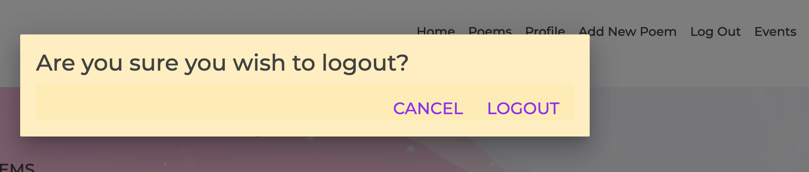
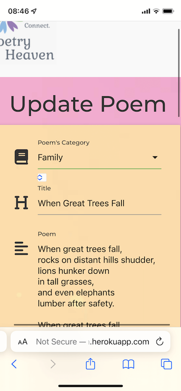

TESTING PROCESS
- - - 
CONTENTS

Code Validation

Testing User Stories

Further Testing

Browser Compatibility

Responsiveness / Device Compatibility

Manual device testing

Lighthouse

Defensive Design

Solved Bugs

Known Bugs

### CODE VALIDATION
The following code validators have been used:

[W3C Markup](https://validator.w3.org/) - to check for errors or warnings in my HTML templates.

I encountered the following error:

After some research on Code Institute Slack channel and on the Web, I found [this](https://rocketvalidator.com/html-validation/element-div-not-allowed-as-child-of-element-ul-in-this-context-suppressing-further-errors-from-this-subtree) resource which helped me understand what had gone wrong. 

> A `
` tag has been found as a direct child of an `<ul>` tag, and this is not allowed. For example, `<ul>
<li>item</li>
</ul>` is not valid, but `<ul><li>
item
</li></ul>` is valid as the direct child of `<ul>` is `<li>`.

I also had the following warning on all templates, however I purposely decided not to include any heading.

There were a few minor formatting errors where tags were missing; however, these have been corrected during validation process.

[CSS Validation Service](https://jigsaw.w3.org/css-validator/) 

Before validating CSS I also used [Autoprefixer](https://autoprefixer.github.io/), to arrange and delete the prefixes.

[JSHint](https://jshint.com/) - to check for errors in my JavaScript code.

[PEP8](http://pep8online.com/) - to check the python code for PEP8 requirements.

### TESTING USER STORIES

-   First Time Visitor Goals
    -   as a First Time Visitor, I want to understand immediately what the website offers

		As soon as the user opens the page, they are taken to a home screen, explaining what the website offers
		  
	
    - as a First Time Visitor, I want to enjoy accessing and navigating through the website easily from any device, whether it is mobile, tables or desktop.
    
        It is a fully responsive website and user can access it from any device. whether it is mobile, tablet, or desktop
     

        Navbar has a clear headings that help the user find what they are looking for.

        Hamburger menu has been implemented for smaller devices
    
    - as a First Time Visitor, I want to be able to easily sign up, with the need to only provide basic personal information

        Navbar contains the link which takes the user to a sign up page. There are only a few details needed in order to sign up. 
    
    - as a First Time Visitor, I want to view all poems to assess if it's worthy signing up

        Visitor, without having to sign up, has the chance to review poems available under poems link in the navbar.
      
    - as a First Time Visitor, I want to be able to search for poems using keywords, so I can find the poems I might like the most

        Above the section with all poems, a visitor can use search functionality to search for poems. The keyword search is based on the title, category and content.
    
    - as a First Time Visitor, I want to be able to filter poems by categories, so I that can find poems accordingly within my favourite category.

        Below the search functionality, user can filter poems by categories. 
    
    - as a First Time Visitor, I want to be able to see more information regarding specific poem i.e. Name of the person who created it and whether they are female or a male, date a poem was created and and where it was created (location). 

        Such information is provided and attached to every poem on the Website.
    

-   Site Member Goals
Please note all goals above also apply for Site Members 
    -  as a Website User, I want to be able to get into my existing account without re-registering

         Login link is provided in the navbar. User will be prompted to provide their username and password. Cookie functionality has been set up so that once registered the system will remember their credentials so user doesn't have to retype it each time.
    
    
    -  as a Website User, I want to have my own profile where I can maintain my poems

        Every registered user has their own profile. Profile link is in the navbar so user has got an easy access to it. 
        
        Flash message greets users every time they log in. In the profile user can view their own poems.
    
  
    - as a Website User, I want to be able to open my poem in a separate page so I'm less distracted

        At the bottom of each poem, user can see a specific poem they want to look at on a separate page. 
        

    -  as a Website User, I want to be able to update my poem

        On the profile page, there is an 'Update' button on the right hand side of each poem. Once clicked, it takes user to a separate page where they can update their poem or info related to that specific poem. All already saved information is pre-populated.
    

    - as a Website User, I want to be able to delete my poem, if I no longer want to share this poem with others

        On the profile page, there is a 'Delete' button on the right hand side of each poem.
    
    
    - as a Website User, I want to be able to go back to previous screen if I accidentally clicked on "Delete" poem. 

        User is asked to confirm whether they want to delete their poem.
    

    - as a Website User, I want to be able to logout of my profile.

        Logout link is in the navbar. 
    

    - as a Website User, I want to be able to go back to the previous screen once accidentally clicked on the logout link.

        Every time user clicks on 'logout', modal appears with a message if they wish to log out.
    

-   Admin Goals

    Please note all goals above also apply for Admin as well.

    -   As an admin, I want to be able to add new categories, so I can keep Poetryheaven updated at all times.

        Only 'admin', once logged in, can view 'Manage Categories' link in the navbar. From there, admin can add a new 	category, in order to keep the page up-to-date.
    
    
    

    -   As an admin, I want to be able to update categories, if I feel it needs the name changing.
    
        The admin can update categories by clicking 'Update' on the specific category field

        

        

    - As an admin, I want to be able to delete a category, if it's no longer needed.

        The admin can delete a category by clicking 'Delete' on the specific category field. Once clicked, they will need to confirm if they definitely want to delete it.

        
        
  
  - Business Owner (or Admin if Admin is the Business Owner)

    Please note all goals above also apply for Business Owner as well.

    -   as the owner, I want to keep my visitors engaged and wanting to come back and share more poems

        The owner of the site is also the business owner and runs the Poetry Cafe, where various events happen related to poetry. 

        
        

    Events Page:

    

    

**Further Testing**

### BROWSER COMPATIBILITY
Site was tested across various browsers:

|  | Chrome | Safari | Firefox | Microsoft Edge |Microsoft Explorer
| ----------- | ----------- | -----------| -----------| -----------|-----------|
| **Appearance** | GOOD |   GOOD |  GOOD |  GOOD (note: on 100% screen size, delete button goes under the update button on the profile and manage categories page, however this still looks ok.  |  GOOD (Although it is 'retiring' in favour of Microsoft Edge over after 25 years, I still decided to test it)
| **Responsiveness** | GOOD | GOOD |  GOOD |  GOOD |  GOOD

### RESPONSIVENESS/ DEVICE COMPATIBILITY
This project has been tested using [Chrome DevTools](https://developer.chrome.com/docs/devtools/). I also used [Responsive Web Design Checker](https://responsivedesignchecker.com/) and [Responsinator](https://www.responsinator.com/). 

Following templates were tested: Home / Poems / Profile / Add New Poem / Manage Categories / Update Poem / Update Category / Events
|  | Links/URL working correctly  | Renders correctly | Layout and Images ok | 
| ----------- | ----------- | -----------| -----------| 
| **Samsung Galaxy S5 / S6 /S7** | YES |   YES |  YES |  text  |  text 
| **Android (Pixel 2)** | YES | YES |  YES |  text |  text
| **iPhone (5/5s, 6/6s/7, 6s Plus, 7 Plus, 8,  iPhone X, XR, 12 Pro)** | YES | YES | YES |
| **iPad** |YES | YES| YES| ----|
| **iPad Pro** | YES |   YES |  YES |
| **iPad Air** | YES |   YES |  YES |
| **Surface Duo** | YES |   YES |  YES |  

I had to make a few minor adjustments to the templates throughout the process of testing templates on different devices (one of the few last commits to GitHub). 

### MANUAL DEVICE TESTING

This app was manually tested on iPhone, iPad, and desktop in order to make sure all functionality works as intended. When testing all screens on iPhone/iPad, I have realised there was a bug related to select field on categories and gender. I documented it in the 'Solved Bugs' section. 

### LIGHTHOUSE
Website's performance has also been tested, using [Lighthouse](https://developers.google.com/web/tools/lighthouse#devtools).

I run Lighthouse in ChromeDev tools. Results below.

| Page | Performance  | Accessibility | Best Practices | SEO | Comments |
| ----------- | ----------- | -----------| -----------| -----------|-----------|
| **Home** | 100 |   92 |  92 |  80  |  Accessibility: 'Links do not have descriptive text' - link takes the user to the Events screen where they can find more info. Improvement made. 
| **Poems** | 93 | 92 |  92 |  90 |  Good Performance 
| **Profile** | 100 |   87 |  92 |90 |  Accessibility: 'Background and foreground colours do not have a sufficient contrast ratio.' - reviewed and decided the colours have enough contract to suit the theme. 'Links do not have a discernible name' - action taken.  
| **Update Poem** | 91 | 84 | 92 |90 |  Accessibility: 'Form elements do not have associated labels' -  added missing aria-labels. 
| **View Poem** |99 | 92| 92| 90 | Good Performance 
| **Manage Categories** | 98 |   86 |  92 |90 |  Accessibility: 'Links do not have a discernible name' - added aria-label to links. 
| **Events** | 97 |   92 |  92 |90 |  Good Performance 

### DEFENSIVE DESIGN
Defensive design has been implemented throughout the project, e.g.:

 -  Log In and Sign Up Form: username and password have to be between 5 and 15 characters, it must contain small and capital letters as well as a number. Also, upon signing up, user has to repeat the password they wish to set.
 -  Profile: user, before deleting their poem, is prompted whether they wish to delete it. 
 -  Add Poem: there is a minimum and maximum number of letters user can insert when creating poem's title, content. Date picker has been put in place to make sure all dates are consistent across the page. 
 -  Delete Category: Admin, before deleting specific category, is prompted whether they wish to delete it.
 -  Log Out: user is prompted to confirm if they definitely want to log out
 -  All forms are validated. 
 

### SOLVED BUGS
 - Issue with rendering the template from MongoDB in the way that it recognises separate lines in poems. 

    To get the result I wanted, I had to iterate over that list using splitlines() method:
``
Then  `{{ line }}`  represented each line in that field
`.splitlines()`  converts that content field into a list.

 - When trying to update poem, the following error appeared: *TypeError: 'Collection' object is not callable. If you meant to call the 'update' method on a 'Collection' object it is failing because no such method exists.*
 To fix it, I had to uninstall the newest version of pymongo and install an older version. I found explanation of why this is happening here: 
https://debugah.com/solved-typeerror-collection-object-is-not-callable-if-you-meant-to-call-the-authenticate-method-on-a-database-object-it-is-failing-because-no-such-method-exists-23011/
https://kb.objectrocket.com/mongo-db/how-to-install-pymongo-and-connect-to-mongodb-in-python-363
update_poem_error.png
Uninstalling 4.0, newest version of pymongo and reinstalling 3.9 version fixed this issue and user can now successfully update their poems. 

 - When working on Search functionality, specifically on returning results and recognising when there are no results, I was getting the following error: "TypeError: object of type 'Cursor' has no len()". 
I tried the count() method but it didn't work, After researching, I found that another student on Slack for Code Institute had the same issue. 
I then understood that prior to working on search functionality, I was returning all poems but not as a list, that is why it was not returning an iterable object. To fix it, I added list() in app.py to my `@app.route("/poems")`.
- Logo not showing on all templates despite the image source being in my base template.
Logo was showing on all templates other than 'profile', 'update_poem', 'update_categories'. This is because I was using a relative path rather than a full path, so the image is connecting to other templates. Issue was fixed by inserting `` list in navbar was pushed outside of the navbar onto templates, when viewing profile as well as on screen sizes with min width of 992px. Decreasing the font size in `

    nav-link` to 1.2rem as well as adjusting media query below fixed the issue. 

        @media only screen and (min-width: 992px)
        html {
        font-size: 13.5px;
        }
- Bugs related to the touch event when adding or updating poem - specifically, category and gender field. 

-- After asking tutor support for some guidance in order to fix this issue, I have worked out I needed to apply an additional style on Select element:

    select {
    -webkit-appearance: none;
    }
By applying this css  it got rid of an the unnecessary element just under the input field.

-- The second issue was that on IPhone, or iPad, while I was selecting the correct category, it was switching to a different one (These issues are non-existent on desktops or Google Chrome).

Ed, tutor from Code institute, helped me finding the article on # [Materialize select and dropdown: Touch event selecting wrong item](https://stackoverflow.com/questions/52850091/materialize-select-and-dropdown-touch-event-selecting-wrong-item).  There is a common bug with  Materialize select elements. In order to fix it, I applied the following code in my js file:

    $(document).click(function(){
    $('li[id^="select-options"]').on('touchend', function (e) {
    e.stopPropagation();
    });
    });
   
 This code stops propagation (“stack” of events that are fired in a web browser), and as an effect it stops the wrong select option being selected.

### KNOWN BUGS

-- The only part that has been unsolved (although not a serious bug), is that on iOS (iPhones and iPads), when user clicks on the "Poem's Category", slightly different dropdown menu appear than when the user clicks directly in the category input field. Screenshots below:

 
One of the reasons it might be happening is that because the event listener is attached to the whole `input-field`. It only happens on iOS therefore the other reason might be a common issue with select functionality on the system when using Materialize. 

[Back to README.md file.](README.md)